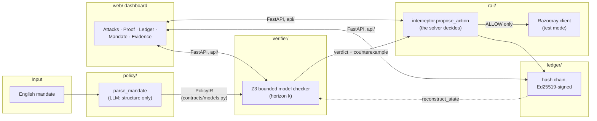

# Bounded

Bounded compiles a plain-English spending mandate into a bounded-horizon SMT
proof that an AI agent's payment actions cannot exceed it, and enforces that
same proof live against a real payment rail (Razorpay test mode).

Run locally — see [Setup](#setup) below.

## Positioning

[AP2](https://ap2-protocol.org) (Google's Agent Payments Protocol) records
what a user authorized. Bounded proves the agent cannot exceed it — a
narrower, different claim, and one AP2 does not attempt.

This is not the first system to gate an agent's payment action before it
reaches the rail: [OAP](https://arxiv.org/abs/2603.20953),
[PCAS](https://arxiv.org/abs/2602.16708), and
[APEX](https://arxiv.org/abs/2604.02023) already established deterministic
pre-action authorization. It is not the first application of SMT to policy:
Cedar, AWS Zelkova, and Google's CEL verifier already proved SMT-backed
policy checking works, for access control.

What's new here: none of the above model a **cumulative** invariant across a
**sequence** of payment actions. Bounded compiles a mandate to a transition
system and uses bounded model checking (Z3) to prove that no reachable
sequence of actions, up to a fixed horizon `k`, can breach the stated
per-transaction cap, window-spend cap, or refund-bounded-by-capture
invariant — then enforces that same check live, in the path of a real
payment rail, and measures it against an LLM-judge baseline with a real
adversarial corpus rather than asserting the comparison.

What this is not: an unbounded guarantee (bounded model checking is sound
only to horizon `k` — see [Limits](#limits)), or a claim to have invented
pre-action authorization or SMT-for-policy generally. Rejecting Cedar for
this project's specific shape is recorded in
[ADR-0001](docs/adr/0001-z3-over-cedar-and-cel.md).

## Results

Pilot run, 46 scenarios across 6 classes (39.1% benign) — see
[docs/EVAL.md](docs/EVAL.md) for the full methodology, corpus breakdown, and
what's real vs. mocked in this harness (the parse, the Z3 verdict, and the
ledger are all real on every trial; only the Razorpay network call is
mocked, and Phase 3/4's tests already prove that call works unmocked).

An **unsound-safe verdict** is a stated violation (`expected_decision:
block` in the scenario) that the pipeline marked ALLOW — the one number
that matters most, because it's the failure mode where the system's own
proof would have been wrong.

| Metric | Ours | LLM-judge baseline |
|---|---|---|
| Unsound-safe verdicts | **0** | 48 |
| False-positive rate, benign flows | **0.0%** (0/144, CI 0.0–2.6) | 9.7% (14/144, CI 5.9–15.7) |
| pass^1, all classes | **100.0%** | 74.2% |
| pass^4, all classes | **100.0%** | 68.7% |
| pass^8, all classes | **100.0%** | 67.4% |

Median Z3 verification latency: 5.042 ms (n=808 calls). The judge's
recorded misses aren't defensible alternate readings — its own logged
reasoning includes arithmetic errors a Z3 encoding over integer paise
cannot make (docs/EVAL.md's false-positive section has the specific
examples).

## Limits

Stated with real weight, not a footnote — full detail and status for each
in [docs/THREATS.md](docs/THREATS.md):

- **Bounded, not unbounded.** Bounded model checking proves no violation is
  reachable within horizon `k` steps. A violation reachable only beyond `k`
  will not be caught. This is the central honesty of the whole approach,
  not a caveat bolted on afterward.
- **The `adversarial_vs_ours` eval class documents observed behaviour
  rather than independently testing it.** Its `expected_decision` values
  were recorded from running the pipeline locally first, per
  [ADR-0013](docs/adr/0013-eval-harness-design-decisions.md) decision #7 —
  so its 100% is a reproducibility result (16 scenarios returning identical
  verdicts across 8 samples each, despite a non-deterministic LLM in the
  parse path), not 16 independent correctness tests. The two real findings
  that class's construction surfaced (below) are the actual result of that
  work, not the percentage.
- **`MAX_AMOUNT_PAISE` blocks are mislabeled.** An action above the
  10,000,000-paise domain bound is correctly blocked (fail-closed holds),
  but the counterexample names it a per-transaction-cap violation even when
  the merchant's stated cap was never actually exceeded. The decision is
  right; the audit explanation is wrong.
- **The interceptor must be the sole path money moves through.** The
  soundness proof is inductive over the ledger's own state reconstruction.
  A refund issued from the Razorpay dashboard by a human, or a webhook for
  an event the interceptor never proposed, is invisible to that
  reconstruction — this is an operational precondition (API-key scoping,
  dashboard access control) external to what this repo can enforce on its
  own, not a gap this repo can close by itself.

## Setup

Pinned: Python 3.11.9 (`.python-version`), every Python dependency exactly
pinned in `pyproject.toml`, Node 20+.

```bash
git clone https://github.com/VarunPahuja/bounded
cd bounded

# Backend
python -m venv .venv
.venv/Scripts/activate   # .venv/bin/activate on macOS/Linux
pip install -e ".[api,verifier,rail,ledger,llm,eval,dev]"

cp .env.example .env
# Fill in: RAZORPAY_KEY_ID, RAZORPAY_KEY_SECRET (rzp_test_* keys),
# AZURE_OPENAI_API_KEY, AZURE_OPENAI_ENDPOINT, AZURE_OPENAI_DEPLOYMENT.
# Missing Razorpay credentials fail at import (rail/config.py) with a
# KeyError naming the exact variable, before the app can boot. Missing
# Azure credentials fail the same way, but only on the first parse call
# (policy/parse.py builds its client lazily) — neither fails silently or
# falls back to a guess.

uvicorn api.main:app --reload --port 8000

# Frontend, separate shell
cd web
npm install
npm run dev   # http://localhost:3000, expects the API at :8000
```

Verify: `pytest` from the repo root — 114 passed, 3 skipped is the known
baseline (`test_webhook_concurrent_duplicate` is a thread-timing flake that
occasionally needs a rerun; the 3 skips are live-Razorpay-fixture tests
that need a reseed, documented in each test's skip reason).

## Architecture



The LLM in `policy/` only ever translates English into the typed
`PolicyIR` and writes human-readable explanations — it never decides
whether a money action is allowed. `verifier/` never imports from
`policy/parse.py` or any LLM client; a test in `tests/test_architecture.py`
asserts this directly. That inversion — the solver decides, not the model
— is the one rule the whole project is built to not break
([ADR-0005](docs/adr/0005-llm-proposes-solver-decides.md)).

## More detail

- [docs/adr/](docs/adr/) — every architecture decision, one page each, numbered and never edited after acceptance (superseded, not erased).
- [docs/LOG.md](docs/LOG.md) — the append-only build log: what shipped, what broke, what changed my mind, per phase.
- [docs/EVAL.md](docs/EVAL.md) — full evaluation methodology and results.
- [docs/THREATS.md](docs/THREATS.md) — every named limitation of the enforcement guarantee.
- [docs/MASTER.md](docs/MASTER.md) — scope, stack, and phase plan this was built against.
